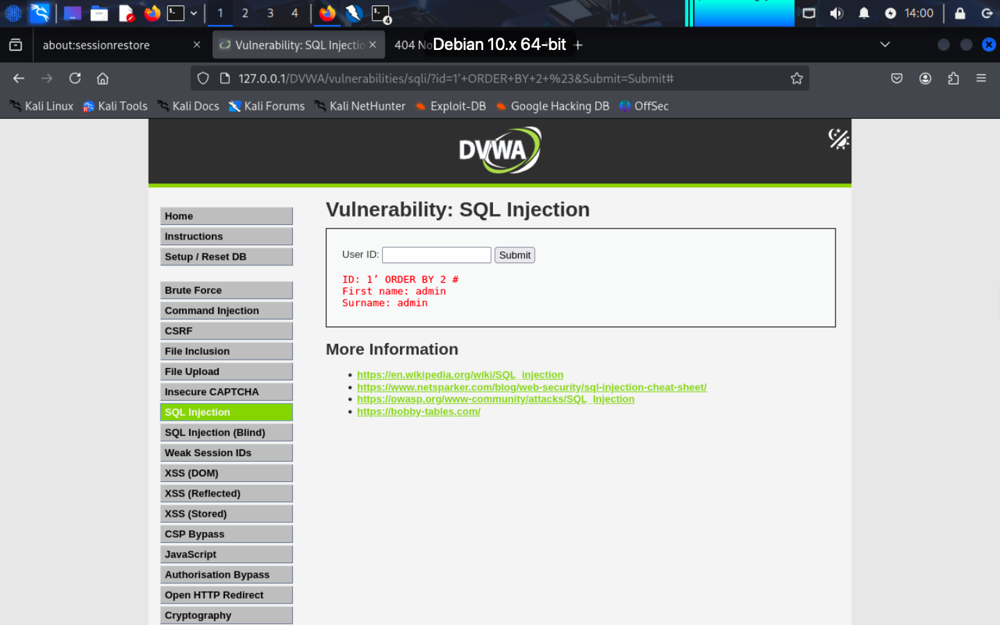
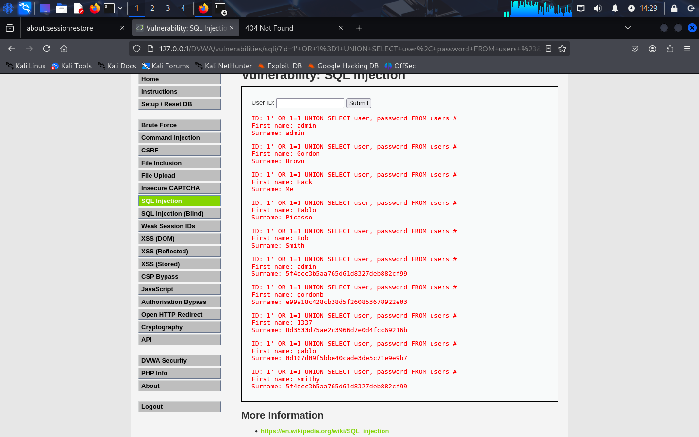
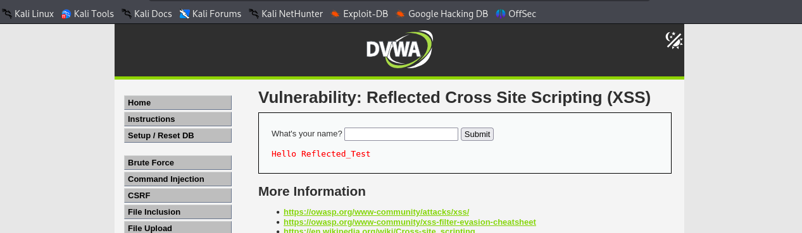
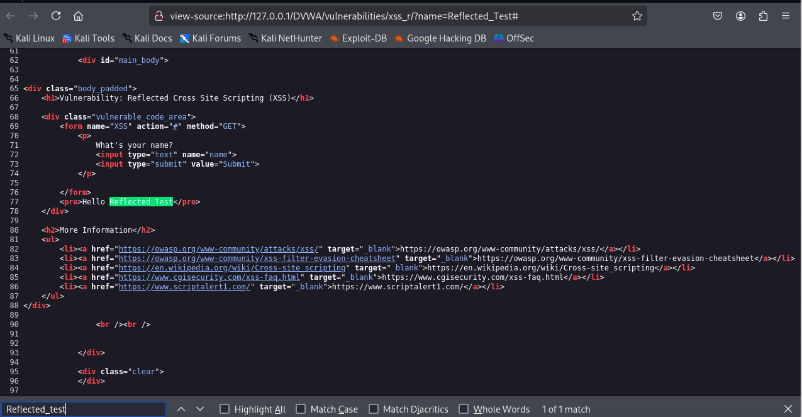
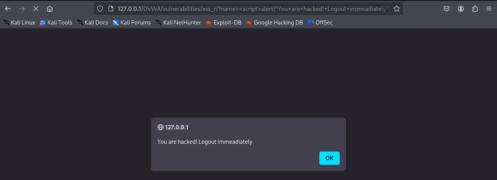
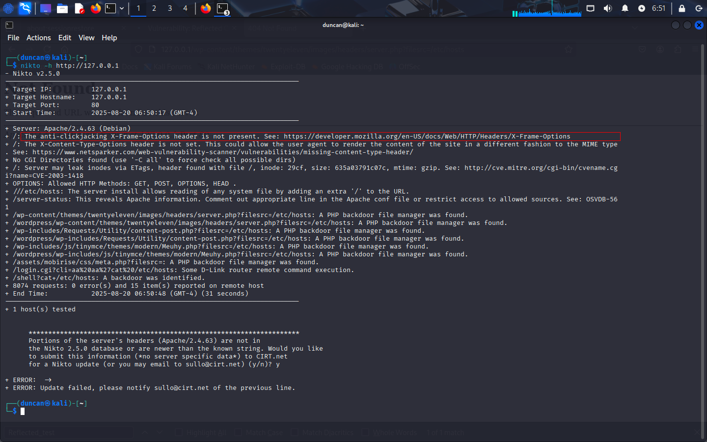
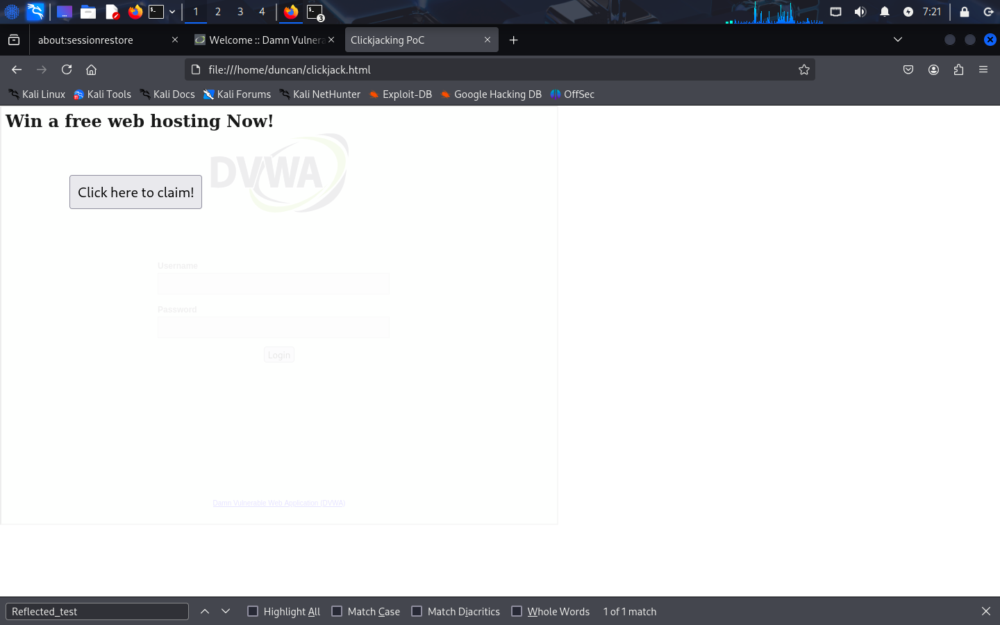

# Web Application Vulnerability Assessment Report


**Project:** Vulnerability Assessment on Damn Vulnerable Web Application  
**Tools Used:** OWASP ZAP, Manual Browser Testing  
**Prepared by:** Duncan Maganga  
**Date:** August 18, 2025  
**Task:** 1  

**Executive Summary**

This is a vulnerability scan report for web applications conducted on Damn Vulnerable Web Application (DVWA) to simulate real-world penetration testing. I was able to find common web vulnerabilities, evaluate their impact in real-world scenarios, and provide remediation recommendations to safeguard web applications.

**Purpose and Scope**

DVWA is a vulnerable web application, and I was concerned about the web vulnerabilities. This test was done in a controlled lab.
Tools and Methodology  

**Target:** Damn Vulnerable Web Application  
**Tools:** Kali Linux 2025 edition  
**Approach:**
- Set up MariaDB and Apache2 for the Dvwa to run on Kali Linux  
- Log in to DVWA using username “admin” and password “password”, and set security to low.  
- Conducted manual and automated tests using the following tools:  
   - OWASP ZAP – Scanning the web for any vulnerabilities  
   - Nikto
   - SQLMap - SQL injection test
   - Manual scan using injections
- Mapping all the vulnerabilities to the OWASP Top 10
- Providing all the screenshots of the scans and tests done


When testing DVWA, we make sure everything is set and working, including that MariaDB is well set up, and Apache2 is running perfectly


When everything is set and open Dvwa with the username – **Admin** and Password – **password**, leave it running. Start OWASP Zap proxy and scan Dvwa, set the browser to be localhost on the ZapProxy dashboard, and scan automatically.


You will find that Content Security Policy is not set, which means the website is not secured properly, and we can perform major attacks on the website.

# Vulnerabilities Identified and Exploited  

## 1.	SQL Injection

**Description:** Injection into ‘ id ’ parameter using SQL query.  
**Tool:** Manual Testing   
**Severity:** High  

When testing for SQL Injection, enter user queries in the search bar in a typical login scenario. When the user enters their login details and clicks submit, the application takes the user’s values for username and password and incorporates them into a SQL query, such as   
```
SELECT * FROM users WHERE username = 'username' AND password = 'password';
``` 

But now we replace the username and its closing quotes with the **' OR 1=1 #**  and now this will appear like this   
```
SELECT * FROM users WHERE username =  ' OR 1=1 # AND password = ‘password’ ;  
```
This single quote denotes a string, and in this case, it is the beginning of the injected input. It modifies the original query, and the **=** sign evaluates the condition to be always true, **OR**  modifies the WHERE clause, and **1=1** always evaluates to true values, and the  # sign ensures that everything that follows is common to doubt. 
This will result in bypassing authentication and returning all the rows of the users’ tables.


## Step 2: Check for the Number of Fields in the Query.

In the user ID enter  **1' ORDER BY 2 #**
 In this scenario, replace username with a single quote **(‘)**. The single quote finishes the query and attempts to find a username with the value that does not exist, and the **ORDER BY 2** is the injection to sort the results of the first column of the table, and the **#** ensures everything follows. When you try to replace 2 with 3, it will be an error, indicating that there are only 2 tables.

 

## Step 3: Check database Version and management system

In the user ID, enter   

```
1' OR 1=1 UNION SELECT 1, VERSION()#
```

This injection **1' OR 1=1** returns all the rows of the tables  and **1 UNION SELECT 1, VERSION()#** adds a row with a value of 1 and version information
 

## Step 4: Retrieve the user credentials
In the user ID, enter 
```
1' OR 1=1 UNION SELECT user, password FROM users #
```
this injection retrieves all the users’ credentials 
 

**Final step:** Copy the hashed passwords and crack them, confirming successful exploitation  

**Mitigation steps:**  
- Use of Prepared Statements (with Parameterized Queries)  
- Use of Properly Constructed Stored Procedures  
- Allow-list Input Validation  


## **Task 2:** Reflected XXS attack at low Security level  
	
**Description:** Injection into ‘ id ’ parameter using script.  
**Tool:** Manual Testing   
**Severity:** High  

In the name ID write **Reflected_Test** and click submit. You will see the message Hello Reflected Test

 

When you search for the source code for the string Reflected Test.

 

Then, when on the user ID enter the   
```
<script>alert('You are hacked! Log out immediately')</script>  
```
An alert box will appear with the word **You are hacked! Log out immediately.** This means this site is vulnerable to reflected XSS attacks, and we have successfully exploited the vulnerability. 
When the user pastes the URL in a different browser, the word **You are hacked! Log out immediately.** will still display, which means a malicious script will execute.

 

### Mitigation steps:  
- Use the auto-escaping template system
- Implement content security policy
- Use the X-XSS-Protection response header
- Use the HTTPOnly flag   
- Use HTML escape before inserting untrusted data into an HTML element’s content  
- Use attribute escape before inserting untrusted data into HTML element content.  
- Use JavaScript escape before inserting untrusted data into JavaScript data values  
- Use CSS escape and strictly validate before inserting untrusted data into HTML style property values.  
- Use URL escape before inserting untrusted data into HTML UTL parameter values  


## Task 3: Clickjacking 

**Description:** Testing Clickjacking.  
**Tool:** Nikto   
**Severity:** High  
When you run Nikto, you will see that the site is vulnerable to clickjacking. The anti-clickjacking X-Frame-Options header is not present.

 

Create a malicious HTML file 

```
<html>
  <head>
    <title>Clickjacking PoC</title>
    <style>
      iframe {
        position:absolute;
        top:0;
        left:0;
        width:800px;
        height:600px;
        opacity:0.1; /* makes it almost invisible */
        z-index:2;
      }
      button {
        position:absolute;
        top:100px;
        left:100px;
        z-index:3;
        font-size:20px;
        padding:10px;
      }
    </style>
  </head>
  <body>
    <h2>Win a free web hosting Now!</h2>
    <button>Click here to claim!</button>

    <!-- Target page inside iframe -->
    <iframe src="http://127.0.0.1/DVWA/security.php"></iframe>
  </body>
</html>

```
In your browser type **file:///home/duncan/clickjack.html**

 

This confirms that the test was successful, and the site is vulnerable to clickjacking.  


### Mitigation:
- Use secure response headers on X-Frame-Options and Content Security Policy.    
- Use frame bursting as a secondary layer.    
- Use Design-level defence, such as double-click confirmation, user interaction, and visual cues.     
