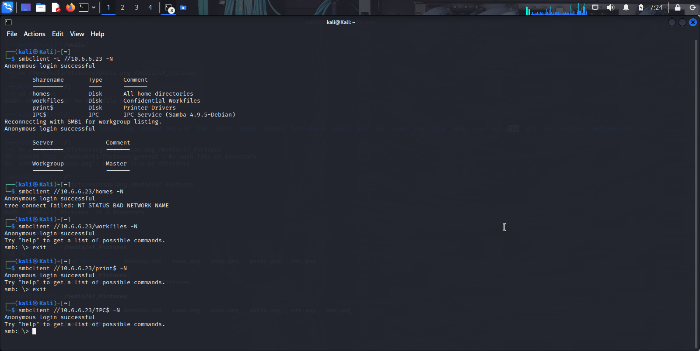
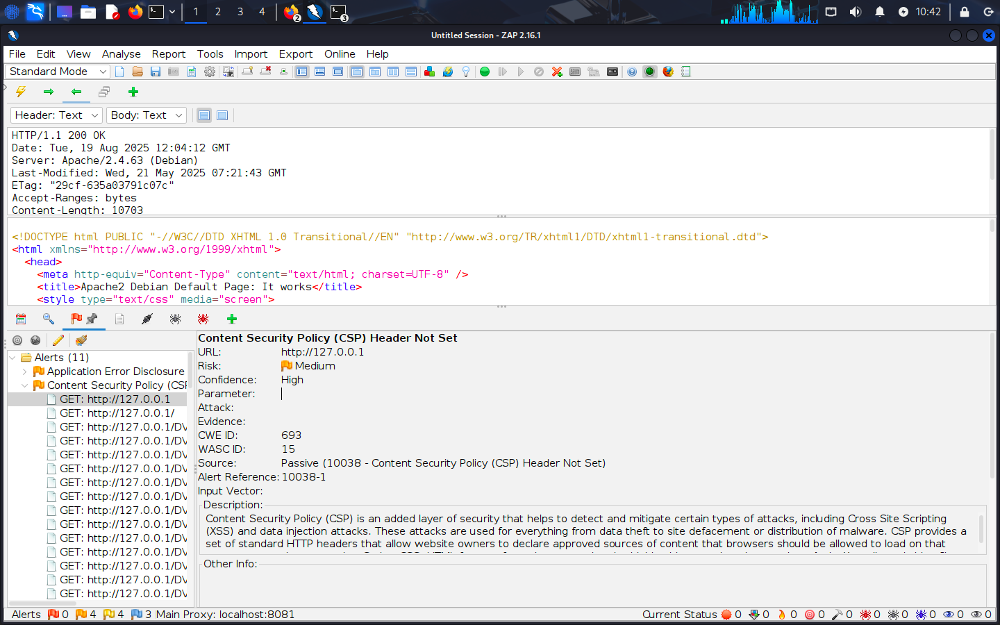
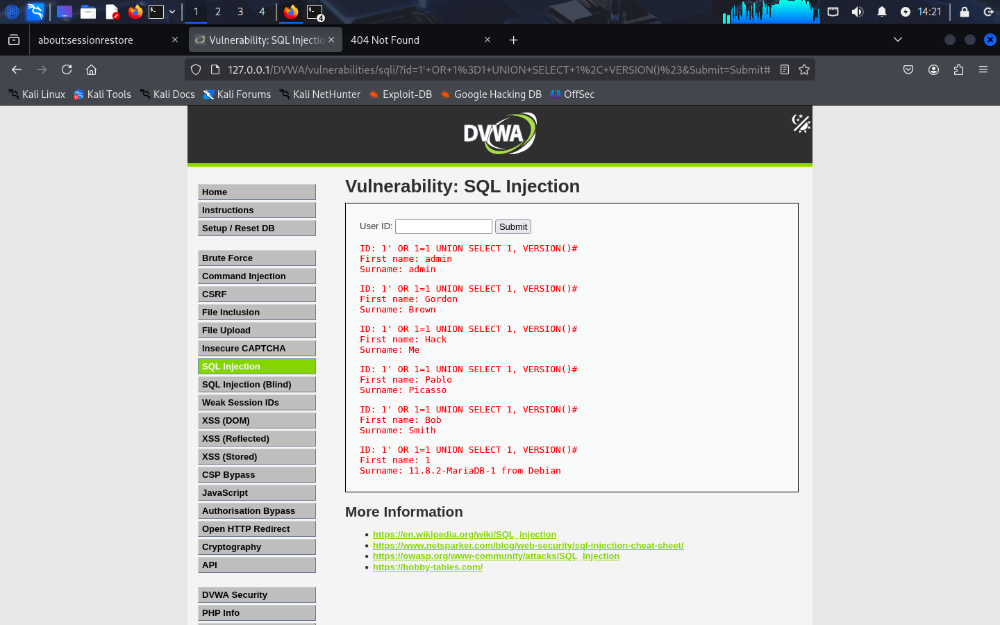

# Web Application Vulnerability Assessment Report


**Project:** Vulnerability Assessment on Damn Vulnerable Web Application  
**Tools Used:** OWASP ZAP, Manual Browser Testing  
**Prepared by:** Duncan Maganga  
**Date:** August 18, 2025  
**Task:** 1  

**Executive Summary**

This is a vulnerability scan report for web applications conducted on Damn Vulnerable Web Application (DVWA) to simulate real-world penetration testing. I was able to find common web vulnerabilities, evaluate their impact in real-world scenarios, and provide remediation recommendations to safeguard web applications.

**Purpose and Scope**

DVWA is a vulnerable web application, and I was concerned about the web vulnerabilities. This test was done in a controlled lab.
Tools and Methodology  

**Target:** Damn Vulnerable Web Application  
**Tools:** Kali Linux 2025 edition  
**Approach:**
- Set up MariaDB and Apache2 for the Dvwa to run on Kali Linux  
- Log in to DVWA using username “admin” and password “password”, and set security to low.  
- Conducted manual and automated tests using the following tools:  
   - OWASP ZAP – Scanning the web for any vulnerabilities  
   - Nikto
   - SQLMap - SQL injection test
   - Manual scan using injections
- Mapping all the vulnerabilities to the OWASP Top 10
- Providing all the screenshots of the scans and tests done


When testing DVWA, we make sure everything is set and working, including that MariaDB is well set up, and Apache2 is running perfectly



When everything is set and open Dvwa with the username – ‘Admin’ and Password – ‘password’, leave it running. Start OWASP Zap proxy and scan Dvwa, set the browser to be localhost on the ZapProxy dashboard, and scan automatically.


You will find that Content Security Policy is not set, which means the website is not secured properly, and we can perform major attacks on the website.

# Vulnerabilities Identified and Exploited  

## 1.	SQL Injection

**Description:** Injection into ‘ id ’ parameter using SQL query.  
**Tool:** Manual Testing   
**Severity:** High  

When testing for SQL Injection, enter user queries in the search bar in a typical login scenario. When the user enters their login details and clicks submit, the application takes the user’s values for username and password and incorporates them into a SQL query, such as   

_SELECT * FROM users WHERE username = ‘username’ AND password = ‘password’ ;  

But now we replace the username and its closing quotes with the ' OR 1=1 #  and now this will appear like this   

_SELECT * FROM users WHERE username =  ' OR 1=1 # AND password = ‘password’ ;  

This single quote denotes a string, and in this case, it is the beginning of the injected input. It modifies the original query, and the **=** sign evaluates the condition to be always true, **OR**  modifies the WHERE clause, and **1=1** always evaluates to true values, and the  # sign ensures that everything that follows is common to doubt. 
This will result in bypassing authentication and returning all the rows of the users’ tables.




```sql
SELECT * FROM users WHERE username = 'username' AND password = 'password';


